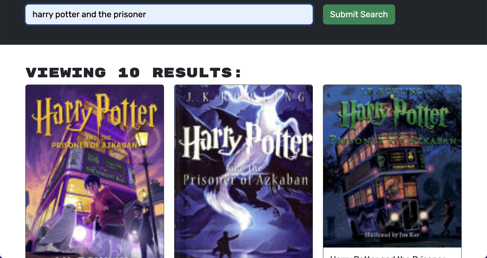

# 21 MERN: Book Search Engine

## Your Task

Your assignment this week is emblematic of the fact that most modern websites are driven by two things: data and user demands. This shouldn't come as a surprise, as the ability to personalize user data is the cornerstone of real-world web development today. And as user demands evolve, applications need to be more performant.

This week, you’ll take starter code with a fully functioning Google Books API search engine built with a RESTful API, and refactor it to be a GraphQL API built with Apollo Server. The app was built using the MERN stack with a React front end, MongoDB database, and Node.js/Express.js server and API. It's already set up to allow users to save book searches to the back end.

To complete the assignment, you’ll need to do the following:

1. Set up an Apollo Server to use GraphQL queries and mutations to fetch and modify data, replacing the existing RESTful API.

2. Modify the existing authentication middleware so that it works in the context of a GraphQL API.

3. Create an Apollo Provider so that requests can communicate with an Apollo Server.

4. Deploy your application to Heroku with a MongoDB database using MongoDB Atlas. Use the [Deploy with Heroku and MongoDB Atlas](https://coding-boot-camp.github.io/full-stack/mongodb/deploy-with-heroku-and-mongodb-atlas) walkthrough for instructions.

## User Story

```md
AS AN avid reader
I WANT to search for new books to read
SO THAT I can keep a list of books to purchase
```

## Acceptance Criteria

```md
GIVEN a book search engine

WHEN I load the search engine
THEN I am presented with a menu with the options Search for Books and Login/Signup and an input field to search for books and a submit button

WHEN I click on the Search for Books menu option
THEN I am presented with an input field to search for books and a submit button

WHEN I am not logged in and enter a search term in the input field and click the submit button
THEN I am presented with several search results, each featuring a book’s title, author, description, image, and a link to that book on the Google Books site

WHEN I click on the Login/Signup menu option
THEN a modal appears on the screen with a toggle between the option to log in or sign up

WHEN the toggle is set to Signup
THEN I am presented with three inputs for a username, an email address, and a password, and a signup button

WHEN the toggle is set to Login
THEN I am presented with two inputs for an email address and a password and login button

WHEN I enter a valid email address and create a password and click on the signup button
THEN my user account is created and I am logged in to the site

WHEN I enter my account’s email address and password and click on the login button
THEN the modal closes and I am logged in to the site

WHEN I am logged in to the site
THEN the menu options change to Search for Books, an option to see my saved books, and Logout

WHEN I am logged in and enter a search term in the input field and click the submit button
THEN I am presented with several search results, each featuring a book’s title, author, description, image, and a link to that book on the Google Books site and a button to save a book to my account

WHEN I click on the Save button on a book
THEN that book’s information is saved to my account

WHEN I click on the option to see my saved books
THEN I am presented with all of the books I have saved to my account, each featuring the book’s title, author, description, image, and a link to that book on the Google Books site and a button to remove a book from my account

WHEN I click on the Delete this Book button on a book
THEN that book is deleted from my saved books list

WHEN I click on the Logout button
THEN I am logged out of the site and presented with a menu with the options Search for Books and Login/Signup and an input field to search for books and a submit button
```

## Mock-Up

### - Homage -


### - Book Search -



### - Saving a Book -


### - Saved Books Page -


### - Deleting a Book -


## Links
### GitHup Repo - https://github.com/edgarmartinez1212/book-search-engine
### Heroku - 


### Technical Acceptance Criteria: 40%

- Satisfies all of the preceding acceptance criteria plus the following:

  - Has an Apollo Server that uses GraphQL queries and mutations to fetch and modify data, replacing the existing RESTful API.

  - Use an Apollo Server and apply it to the Express.js server as middleware.

  - Include schema settings for resolvers and typeDefs as outlined in the Challenge instructions.

  - Modify the existing authentication middleware to work in the context of a GraphQL API.

  - Use an Apollo Provider so that the application can communicate with the Apollo Server.

  - Application must be deployed to Heroku.

### Deployment: 32%

- Application deployed at live URL.

- Application loads with no errors.

- Application GitHub URL submitted.

- GitHub repository contains application code.

### Application Quality: 15%

- User experience is intuitive and easy to navigate.

- User interface style is clean and polished.

- Application resembles the mock-up functionality provided in the Challenge instructions.

### Repository Quality: 13%

- Repository has a unique name.

- Repository follows best practices for file structure and naming conventions.

- Repository follows best practices for class/id naming conventions, indentation, quality comments, etc.

- Repository contains multiple descriptive commit messages.

- Repository contains high-quality README file with description, screenshot, and link to the deployed application.

## Review

You are required to submit BOTH of the following for review:

- The URL of the functional, deployed application.

- The URL of the GitHub repository. Give the repository a unique name and include a README describing the project.

---

© 2023 edX Boot Camps LLC. Confidential and Proprietary. All Rights Reserved.
